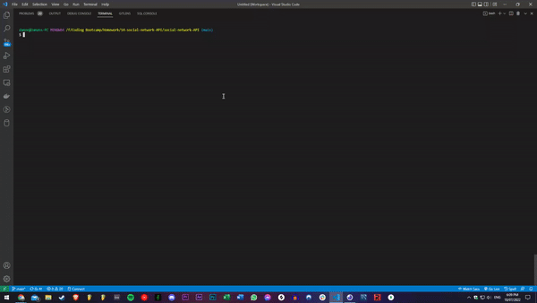
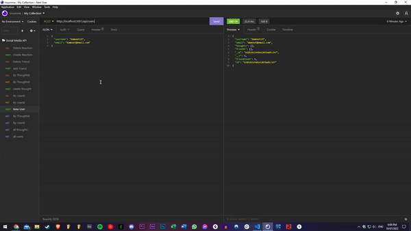
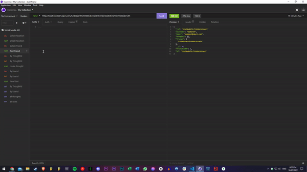

# social-network-API


## Description
A basic Social Network API built using MongoDB. Stores user data, thoughts and reactions. Can also add friends. API allows you to perform CRUD operations on all data. The backend is an express server. A walk-through of the application can be found [here](https://youtu.be/4b9upYeeLMs).


## Table of Contents
1. [Installation](#installation)
2. [Usage](#usage)
3. [License](#license)
4. [Contributing](#contributing)
5. [Tests](#tests)
6. [Questions](#questions)

## Installation
- To install the application please follow the instructions below.
```bash
- git clone git@github.com:daman29/social-network-API.git
- npm i
```

## Usage
- Run the application with the following command:
```bash
- npm start
```
- Visit the application repository at [GitHub Repository](https://github.com/daman29/social-network-API)

- [Click on this link](https://youtu.be/4b9upYeeLMs) to view the video demo of the application.

The GIF below shows the start-up and GET routes for Users and Thoughts




GET, PUT and DELETE Routes



Friends and Reaction POST and Delete Routes




## License
- This application is licensed under the [MIT License](./LICENSE)

## Contributing
- Clone repository first using git clone
- Contribute your changes to a new branch

## Tests
- No test commands

## Questions
- Reach me via email at damneet.sambhy@hotmail.com or issues on [github](https://github.com/daman29)